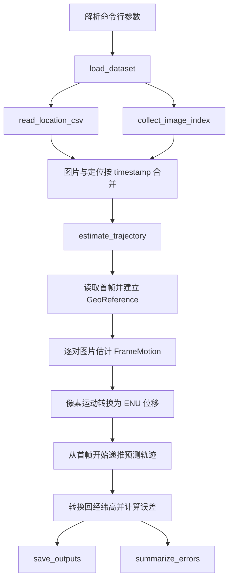

# 代码阅读与开发说明

本文档面向后续阅读、维护和扩展代码的开发者，说明项目的模块职责、核心数据结构、每个函数的输入输出、重要中间数据含义，以及一次轨迹估计任务的完整调用链路。

## 目录结构

```text
UAV/
├── run_trajectory.py              # 单次轨迹估计入口
├── compare_methods.py             # 多方法对比入口
├── requirements.txt               # 运行依赖
├── pyproject.toml                 # Python 包配置
├── src/
│   └── uav_trajectory/
│       ├── __init__.py
│       ├── data.py                # 数据读取与时间戳匹配
│       ├── geo.py                 # 经纬高与 ENU 坐标转换
│       ├── vision.py              # 相邻图像运动估计
│       └── estimator.py           # 轨迹递推、误差统计和结果保存
└── docs/
    └── CODE_GUIDE.md              # 本文档
```

`data/` 和 `outputs/` 已被 `.gitignore` 忽略，不进入版本管理。

## 总体调用链路

一次 `run_trajectory.py` 运行的主要流程如下：



## 核心数据结构

### DatasetConfig

位置：[src/uav_trajectory/data.py](../src/uav_trajectory/data.py)

```python
@dataclass(frozen=True)
class DatasetConfig:
    image_dir: Path
    csv_path: Path
```

用于描述数据来源。

- `image_dir`：图片目录，默认 `data/IR-image`。
- `csv_path`：定位 CSV 路径，默认 `data/定位数据.csv`。

该类是不可变 dataclass，避免运行过程中误改数据路径。

### GeoReference

位置：[src/uav_trajectory/geo.py](../src/uav_trajectory/geo.py)

```python
@dataclass(frozen=True)
class GeoReference:
    longitude: float
    latitude: float
    altitude: float
```

用于定义局部 ENU 坐标系的原点。当前实现使用选定序列的第一帧真实经纬高作为参考点。

- `longitude`：参考经度。
- `latitude`：参考纬度。
- `altitude`：参考高度。
- `latitude_rad`：纬度弧度属性，用于经度方向米制换算。

### FrameMotion

位置：[src/uav_trajectory/vision.py](../src/uav_trajectory/vision.py)

```python
@dataclass(frozen=True)
class FrameMotion:
    dx_px: float
    dy_px: float
    scale: float
    confidence: float
    method: str
    matches: int
    inliers: int
```

表示相邻两帧之间的图像运动估计结果。

- `dx_px`：图像 x 方向位移，单位像素。
- `dy_px`：图像 y 方向位移，单位像素。
- `scale`：图像尺度变化，`orb_affine` 从仿射矩阵估计；`phase` 固定为 `1.0`。
- `confidence`：置信度。`orb_affine` 为 RANSAC 内点数除以好匹配数；`phase` 为 `cv2.phaseCorrelate` 响应值。
- `method`：方法名，例如 `orb_affine` 或 `phase`。
- `matches`：ORB 通过 ratio test 后的匹配数量。
- `inliers`：RANSAC 内点数量。

### EstimationConfig

位置：[src/uav_trajectory/estimator.py](../src/uav_trajectory/estimator.py)

```python
@dataclass(frozen=True)
class EstimationConfig:
    method: str = "orb_affine"
    horizontal_fov_deg: float = 60.0
    yaw_deg: float = 0.0
    max_width: int = 960
    max_frames: int | None = None
    start_index: int = 0
    height_from_scale: bool = False
    calibration_frames: int = 0
```

轨迹估计的完整参数集合。

- `method`：图像运动估计方法，支持 `orb_affine` 和 `phase`。
- `horizontal_fov_deg`：相机水平视场角，用于像素到米换算。
- `yaw_deg`：图像坐标系相对 ENU 坐标系的旋转角假设。
- `max_width`：图像最大处理宽度，降低该值可以加速。
- `max_frames`：最大处理帧数，`None` 表示处理选定起点后的全部帧。
- `start_index`：从匹配后数据表的第几行开始。
- `height_from_scale`：是否使用图像仿射尺度更新高度，默认关闭。
- `calibration_frames`：使用前 N 帧真值拟合像素到 ENU 的线性映射，默认关闭。

## 模块说明

## data.py

`data.py` 负责读取 CSV、扫描图片目录，并按时间戳把两者匹配成统一数据表。

### read_location_csv(csv_path)

```python
def read_location_csv(csv_path: Path) -> pd.DataFrame
```

读取定位 CSV 并规范字段。

输入：

- `csv_path`：CSV 文件路径。

处理逻辑：

1. 依次尝试 `utf-8-sig`、`utf-8`、`gb18030`、`gbk` 编码。
2. 将中文字段重命名为内部字段：
   - `时间戳` -> `timestamp`
   - `经度` -> `longitude`
   - `纬度` -> `latitude`
   - `高度` -> `altitude`
3. 检查必需字段是否存在。
4. 将 `timestamp` 转为整数。
5. 将经度、纬度、高度转为数值。
6. 按时间戳排序，并去除重复时间戳。

输出：

`pd.DataFrame`，至少包含：

```text
timestamp, longitude, latitude, altitude
```

异常：

- CSV 编码无法识别时抛出 `UnicodeDecodeError`。
- 必需字段缺失时抛出 `ValueError`。

### collect_image_index(image_dir)

```python
def collect_image_index(image_dir: Path) -> pd.DataFrame
```

扫描图片目录，建立图片时间戳索引。

输入：

- `image_dir`：图片文件夹。

处理逻辑：

1. 遍历目录下所有 `*.jpg` 文件。
2. 将文件名主干解析为整数时间戳。
3. 非数字文件名会被跳过。
4. 返回 `timestamp` 与 `image_path` 对应关系。

输出：

```text
timestamp, image_path
```

异常：

- 未找到任何合法 jpg 图片时抛出 `FileNotFoundError`。

### load_dataset(config)

```python
def load_dataset(config: DatasetConfig) -> pd.DataFrame
```

加载并合并图片和定位数据。

输入：

- `config.image_dir`：图片目录。
- `config.csv_path`：定位 CSV。

处理逻辑：

1. 调用 `read_location_csv` 读取定位。
2. 调用 `collect_image_index` 读取图片索引。
3. 用 `timestamp` 做 inner join。
4. 按时间戳排序。
5. 检查匹配结果是否至少有 2 帧。

输出：

```text
timestamp, image_path, longitude, latitude, altitude
```

这是 `estimate_trajectory` 的主输入。

## geo.py

`geo.py` 负责地理坐标和局部 ENU 坐标互相转换。

### EARTH_RADIUS_M

```python
EARTH_RADIUS_M = 6_378_137.0
```

地球近似半径，单位米。当前使用简化球面近似，适合小范围轨迹的局部换算。

### GeoReference.latitude_rad

```python
@property
def latitude_rad(self) -> float
```

将参考纬度从角度转换为弧度。

用途：

- 经度方向距离换算需要乘以 `cos(latitude)`。

### geodetic_to_enu(...)

```python
def geodetic_to_enu(
    longitude: np.ndarray,
    latitude: np.ndarray,
    altitude: np.ndarray,
    reference: GeoReference,
) -> np.ndarray
```

将经纬高转换为局部 ENU 坐标。

输入：

- `longitude`：经度数组。
- `latitude`：纬度数组。
- `altitude`：高度数组。
- `reference`：局部坐标原点。

计算：

- `east = Δlongitude_rad * R * cos(reference_latitude)`
- `north = Δlatitude_rad * R`
- `up = altitude - reference.altitude`

输出：

形状为 `(N, 3)` 的 `np.ndarray`：

```text
[:, 0] east_m
[:, 1] north_m
[:, 2] up_m
```

### enu_to_geodetic(...)

```python
def enu_to_geodetic(enu: np.ndarray, reference: GeoReference) -> np.ndarray
```

将局部 ENU 坐标转换回经纬高。

输入：

- `enu`：形状 `(N, 3)`，单位米。
- `reference`：局部坐标原点。

输出：

形状 `(N, 3)`：

```text
[:, 0] longitude
[:, 1] latitude
[:, 2] altitude
```

### horizontal_errors_m(...)

```python
def horizontal_errors_m(predicted_enu: np.ndarray, truth_enu: np.ndarray) -> np.ndarray
```

计算预测轨迹和真实轨迹的水平误差。

输入：

- `predicted_enu`：预测 ENU。
- `truth_enu`：真实 ENU。

输出：

长度为 `N` 的数组：

```text
sqrt((pred_east - truth_east)^2 + (pred_north - truth_north)^2)
```

## vision.py

`vision.py` 负责从相邻两张图片估计图像空间运动。

### read_gray(image_path, max_width)

```python
def read_gray(image_path: str | Path, max_width: int = 960) -> np.ndarray
```

读取图片为灰度图，并按最大宽度等比例缩放。

输入：

- `image_path`：图片路径。
- `max_width`：最大宽度。如果原图宽度大于该值，会缩小。

输出：

- 灰度图 `np.ndarray`，形状 `(height, width)`。

异常：

- 图片无法读取时抛出 `FileNotFoundError`。

### OrbAffineEstimator.__init__(max_features, ratio)

```python
def __init__(self, max_features: int = 2500, ratio: float = 0.78)
```

初始化 ORB 特征检测器和 Hamming 距离匹配器。

参数：

- `max_features`：ORB 最多提取的特征点数量。
- `ratio`：Lowe ratio test 阈值，越小匹配越严格。

内部对象：

- `cv2.ORB_create(...)`
- `cv2.BFMatcher(cv2.NORM_HAMMING)`

### OrbAffineEstimator.estimate(prev_gray, curr_gray)

```python
def estimate(self, prev_gray: np.ndarray, curr_gray: np.ndarray) -> FrameMotion
```

使用 ORB 特征匹配和 RANSAC 仿射估计相邻图像运动。

输入：

- `prev_gray`：上一帧灰度图。
- `curr_gray`：当前帧灰度图。

处理逻辑：

1. 分别提取 ORB 关键点和描述子。
2. 如果任一帧特征不足，返回零位移、低置信度结果。
3. 使用 KNN 匹配，`k=2`。
4. 使用 ratio test 筛选好匹配。
5. 用 `cv2.estimateAffinePartial2D` 和 RANSAC 估计部分仿射矩阵。
6. 从矩阵中读取平移 `dx_px/dy_px`。
7. 从矩阵左上角旋转缩放部分估计 `scale`。
8. 用内点比例计算 `confidence`。

输出：

`FrameMotion`。

注意：

- 这里的 `dx_px/dy_px` 描述的是图像特征从上一帧到当前帧的移动，不是无人机在真实世界中的直接位移。
- 在 `estimator.py` 中会把图像运动转换为无人机 ENU 位移。

### PhaseCorrelationEstimator.estimate(prev_gray, curr_gray)

```python
def estimate(self, prev_gray: np.ndarray, curr_gray: np.ndarray) -> FrameMotion
```

使用相位相关估计两帧之间的全局平移。

输入：

- `prev_gray`：上一帧灰度图。
- `curr_gray`：当前帧灰度图。

处理逻辑：

1. 裁剪两张图到共同尺寸。
2. 转为 `float32`。
3. 调用 `cv2.phaseCorrelate`。
4. 将返回的 shift 和 response 写入 `FrameMotion`。

输出：

`FrameMotion`，其中：

- `scale = 1.0`
- `matches = 0`
- `inliers = 0`

适用场景：

- 画面整体平移明显。
- 作为 ORB 方法的速度基线或对照方法。

### create_estimator(method)

```python
def create_estimator(method: str)
```

根据方法名创建图像运动估计器。

输入：

- `method = "orb_affine"`：返回 `OrbAffineEstimator`。
- `method = "phase"`：返回 `PhaseCorrelationEstimator`。

异常：

- 未知方法名抛出 `ValueError`。

## estimator.py

`estimator.py` 是项目核心，负责把图像运动转换为无人机轨迹。

### _meters_per_pixel(altitude_m, width_px, horizontal_fov_deg)

```python
def _meters_per_pixel(altitude_m: float, width_px: int, horizontal_fov_deg: float) -> float
```

估计当前高度下，一个像素对应的地面距离。

输入：

- `altitude_m`：当前绝对高度，单位米。
- `width_px`：处理后的图像宽度。
- `horizontal_fov_deg`：相机水平视场角。

计算：

```text
footprint_width_m = 2 * altitude_m * tan(horizontal_fov / 2)
meters_per_pixel = footprint_width_m / width_px
```

输出：

- 每像素对应米数。

限制：

- 假设相机近似俯视地面。
- 假设地面近似平面。
- 使用的是水平 FOV，不考虑镜头畸变和姿态。

### _rotate_image_motion_to_enu(dx_m, dy_m, yaw_deg)

```python
def _rotate_image_motion_to_enu(dx_m: float, dy_m: float, yaw_deg: float) -> tuple[float, float]
```

将图像平面上的米制位移转换为 ENU 水平位移。

输入：

- `dx_m`：图像 x 方向位移换算后的米数。
- `dy_m`：图像 y 方向位移换算后的米数。
- `yaw_deg`：图像坐标系相对 ENU 的旋转角。

处理逻辑：

1. 图像特征运动和无人机自身运动方向并不完全相同。
2. 默认认为图像向右对应 east 方向，图像向下对应 north 方向。
3. 再按 `yaw_deg` 旋转到 ENU 坐标。

输出：

```text
(east_m, north_m)
```

### estimate_trajectory(frame_table, config)

```python
def estimate_trajectory(frame_table: pd.DataFrame, config: EstimationConfig) -> pd.DataFrame
```

完整轨迹估计函数。

输入：

- `frame_table`：由 `load_dataset` 生成的数据表。
- `config`：估计参数。

输入表必须包含：

```text
timestamp, image_path, longitude, latitude, altitude
```

处理阶段：

1. 检查 `start_index` 是否有效。
2. 根据 `start_index` 和 `max_frames` 截取序列。
3. 使用序列第一帧建立 `GeoReference`。
4. 将真实经纬高转换为 `truth_enu`，用于误差计算和可选标定。
5. 创建图像运动估计器。
6. 从第一帧开始逐对读取图片。
7. 对每对相邻图片调用 `estimator.estimate`，生成 `FrameMotion` 列表。
8. 若 `calibration_frames > 1`，调用 `_fit_pixel_to_enu` 拟合像素到 ENU 的线性映射。
9. 从首帧 ENU 原点开始递推预测轨迹：
   - 标定模式：用 `_apply_pixel_to_enu` 得到位移。
   - 非标定模式：用 `_meters_per_pixel` 和 `_rotate_image_motion_to_enu` 得到位移。
10. 根据 `height_from_scale` 决定是否用 `scale` 更新高度。
11. 将预测 ENU 转回经纬高。
12. 计算水平误差、高度误差和三维误差。
13. 合并运动诊断字段，返回结果表。

输出：

`pd.DataFrame`，包含真实值、预测值、误差和图像运动诊断信息。详见本文档“结果表字段”。

### summarize_errors(result)

```python
def summarize_errors(result: pd.DataFrame) -> dict[str, float]
```

汇总误差统计。

输入：

- `result`：`estimate_trajectory` 输出表。

处理字段：

- `horizontal_error_m`
- `altitude_error_m`
- `total_error_m`

输出：

每个误差字段对应：

- `mean`：绝对值平均误差。
- `median`：绝对值中位误差。
- `max`：绝对值最大误差。
- `rmse`：均方根误差。

### _fit_pixel_to_enu(motions, truth_enu, calibration_frames)

```python
def _fit_pixel_to_enu(motions, truth_enu: np.ndarray, calibration_frames: int) -> np.ndarray | None
```

使用前 N 帧真值拟合像素位移到 ENU 位移的线性映射。

输入：

- `motions`：`FrameMotion` 列表。
- `truth_enu`：真实 ENU 轨迹。
- `calibration_frames`：用于标定的帧数。

处理逻辑：

1. 若 `calibration_frames <= 1`，返回 `None`。
2. 取前 `calibration_frames - 1` 个相邻帧运动。
3. 构造像素位移矩阵：

```text
[[dx_px_1, dy_px_1],
 [dx_px_2, dy_px_2],
 ...]
```

4. 构造真实 ENU 水平位移：

```text
[[east_step_1, north_step_1],
 [east_step_2, north_step_2],
 ...]
```

5. 使用最小二乘拟合 2x2 矩阵。

输出：

- 成功时返回 `np.ndarray`，形状 `(2, 2)`。
- 不满足标定条件时返回 `None`。

注意：

该函数使用了首帧之后的真实定位数据，因此不能视为纯图像推理，只能用于标定、评估或估计算法上限。

### _apply_pixel_to_enu(dx_px, dy_px, matrix)

```python
def _apply_pixel_to_enu(dx_px: float, dy_px: float, matrix: np.ndarray) -> tuple[float, float]
```

使用 `_fit_pixel_to_enu` 得到的矩阵，把单帧像素位移转换为 ENU 位移。

输入：

- `dx_px`：像素 x 位移。
- `dy_px`：像素 y 位移。
- `matrix`：像素到 ENU 的 2x2 线性映射。

输出：

```text
(east_m, north_m)
```

### save_outputs(result, output_dir, prefix)

```python
def save_outputs(result: pd.DataFrame, output_dir: Path, prefix: str) -> tuple[Path, Path]
```

保存估计结果和轨迹图。

输入：

- `result`：`estimate_trajectory` 输出表。
- `output_dir`：输出目录。
- `prefix`：输出文件名前缀。

输出文件：

- `{prefix}_results.csv`
- `{prefix}_trajectory.png`

轨迹图内容：

- 真实 ENU 轨迹。
- 预测 ENU 轨迹。
- 起点标记。

返回：

```text
(csv_path, plot_path)
```

## run_trajectory.py

单次轨迹估计命令行入口。

### build_parser()

```python
def build_parser() -> argparse.ArgumentParser
```

定义命令行参数，包括数据路径、输出目录、估计方法、起始帧、处理帧数、FOV、yaw、最大宽度、高度估计和标定帧数。

### main()

```python
def main() -> None
```

执行完整流程：

1. 解析命令行参数。
2. 调用 `load_dataset`。
3. 构造 `EstimationConfig`。
4. 调用 `estimate_trajectory`。
5. 生成输出文件名前缀。
6. 调用 `save_outputs`。
7. 调用 `summarize_errors` 并打印误差统计。
8. 打印前 N 行样例结果。

## compare_methods.py

多方法对比入口，用于在同一段数据上运行 `orb_affine` 和 `phase`。

### build_parser()

```python
def build_parser() -> argparse.ArgumentParser
```

定义方法对比脚本需要的命令行参数。

### main()

```python
def main() -> None
```

执行流程：

1. 解析参数。
2. 加载数据集。
3. 依次运行 `orb_affine` 和 `phase`。
4. 分别保存每种方法的 CSV 和轨迹图。
5. 汇总误差统计。
6. 保存 `method_summary.csv`。

## 结果表字段

`estimate_trajectory` 和输出 CSV 中的主要字段如下。

### 输入与真实值字段

| 字段 | 类型 | 含义 |
| --- | --- | --- |
| `timestamp` | int | 图片和定位记录的时间戳 |
| `image_path` | str | 图片路径 |
| `truth_longitude` | float | CSV 真实经度 |
| `truth_latitude` | float | CSV 真实纬度 |
| `truth_altitude` | float | CSV 真实高度 |
| `truth_east_m` | float | 真实 ENU east |
| `truth_north_m` | float | 真实 ENU north |
| `truth_up_m` | float | 真实 ENU up |

### 预测字段

| 字段 | 类型 | 含义 |
| --- | --- | --- |
| `pred_longitude` | float | 预测经度 |
| `pred_latitude` | float | 预测纬度 |
| `pred_altitude` | float | 预测高度 |
| `pred_east_m` | float | 预测 ENU east |
| `pred_north_m` | float | 预测 ENU north |
| `pred_up_m` | float | 预测 ENU up |

### 误差字段

| 字段 | 类型 | 含义 |
| --- | --- | --- |
| `horizontal_error_m` | float | 水平误差 |
| `altitude_error_m` | float | 高度误差，`pred_altitude - truth_altitude` |
| `total_error_m` | float | 三维欧氏误差 |

### 图像运动诊断字段

| 字段 | 类型 | 含义 |
| --- | --- | --- |
| `dx_px` | float | 相邻帧图像 x 位移 |
| `dy_px` | float | 相邻帧图像 y 位移 |
| `scale` | float | 图像尺度变化 |
| `confidence` | float | 运动估计置信度 |
| `matches` | int | ORB 好匹配数量 |
| `inliers` | int | RANSAC 内点数量 |
| `meters_per_pixel` | float | 非标定模式下的像素到米比例；标定模式为 NaN |
| `step_east_m` | float | 当前帧递推使用的 east 位移 |
| `step_north_m` | float | 当前帧递推使用的 north 位移 |
| `calibration_frames` | int | 本次运行使用的标定帧数 |

第一帧没有上一帧，因此 `dx_px/dy_px/scale/confidence` 等运动字段通常为空。

## 重要中间变量

### frame_table

由 `load_dataset` 返回，是轨迹估计主输入。

```text
timestamp, image_path, longitude, latitude, altitude
```

### data

`estimate_trajectory` 内部按 `start_index` 和 `max_frames` 截取后的数据表。所有后续计算都只针对该片段。

### truth_enu

真实轨迹在局部 ENU 坐标系下的表示，形状 `(N, 3)`。

用途：

- 计算误差。
- `calibration_frames` 大于 1 时拟合像素到 ENU 映射。

### motions

相邻帧图像运动列表，长度为 `N - 1`。每个元素是 `FrameMotion`。

### motion_rows

用于最终输出 CSV 的图像运动诊断记录列表。每一行对应第 2 帧及之后的某一帧。

### predicted_enu

预测轨迹，形状 `(N, 3)`。

- 第 0 行等于原点 `[0, 0, 0]`。
- 后续行由相邻图像运动逐帧累加得到。

### predicted_geo

`predicted_enu` 转回经纬高后的结果，形状 `(N, 3)`。

## 扩展建议

### 新增一种图像运动估计方法

1. 在 [vision.py](../src/uav_trajectory/vision.py) 中新增一个类。
2. 实现 `estimate(prev_gray, curr_gray) -> FrameMotion`。
3. 在 `create_estimator` 中加入方法名分支。
4. 在 `run_trajectory.py` 的 `--method` choices 中加入新方法名。
5. 在 `compare_methods.py` 中按需加入对比列表。

### 新增一种坐标转换或融合策略

建议优先修改 [estimator.py](../src/uav_trajectory/estimator.py)：

- 如果只是改变像素到米的换算，可替换 `_meters_per_pixel`。
- 如果只是改变图像坐标到 ENU 的方向关系，可替换 `_rotate_image_motion_to_enu`。
- 如果要接入 IMU/GNSS 融合，建议新增单独模块，例如 `fusion.py`，再由 `estimate_trajectory` 调用。

### 新增输出诊断信息

1. 在图像估计阶段加入字段到 `motion_rows`。
2. 或在轨迹递推阶段加入字段到 `result`。
3. `save_outputs` 会自动把 `result` 全部字段写入 CSV。

## 常见调试入口

小样本运行：

```powershell
conda run -n uav python run_trajectory.py --max-frames 10 --print-rows 10
```

中间片段运行：

```powershell
conda run -n uav python run_trajectory.py --start-index 500 --max-frames 20 --print-rows 20
```

使用标定模式查看图像运动估计上限：

```powershell
conda run -n uav python run_trajectory.py --max-frames 50 --calibration-frames 20
```

对比两种方法：

```powershell
conda run -n uav python compare_methods.py --max-frames 50 --calibration-frames 20
```
