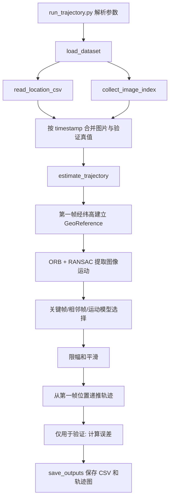

# 代码阅读与开发说明

本文档说明当前主方案的代码结构、函数职责、核心数据和扩展位置。项目已去除方案对比逻辑，只保留 `ORB + RANSAC 仿射 + 关键帧递推优化` 这一条主流程。

## 当前算法边界

估计算法只允许使用：

- 第一帧经度、纬度、高度。
- 第一帧及之后的连续图像。
- 命令行输入的相机/递推参数。

CSV 中后续帧的经度、纬度和高度只用于验证误差。代码中 `truth_enu` 只参与误差计算，不参与后续预测位置更新。

## 目录结构

```text
UAV/
├── run_trajectory.py
├── requirements.txt
├── pyproject.toml
├── src/
│   └── uav_trajectory/
│       ├── __init__.py
│       ├── data.py
│       ├── geo.py
│       ├── vision.py
│       └── estimator.py
└── docs/
    └── CODE_GUIDE.md
```

## 总体调用链路



## 核心数据结构

### DatasetConfig

位置：[src/uav_trajectory/data.py](../src/uav_trajectory/data.py)

```python
@dataclass(frozen=True)
class DatasetConfig:
    image_dir: Path
    csv_path: Path
```

- `image_dir`：图片目录。
- `csv_path`：验证 CSV 路径。

### GeoReference

位置：[src/uav_trajectory/geo.py](../src/uav_trajectory/geo.py)

```python
@dataclass(frozen=True)
class GeoReference:
    longitude: float
    latitude: float
    altitude: float
```

表示局部 ENU 坐标系原点。当前始终使用选定序列第一帧真实经纬高。

### FrameMotion

位置：[src/uav_trajectory/vision.py](../src/uav_trajectory/vision.py)

```python
@dataclass(frozen=True)
class FrameMotion:
    dx_px: float
    dy_px: float
    scale: float
    confidence: float
    method: str
    matches: int
    inliers: int
```

- `dx_px/dy_px`：图像特征从参考帧到当前帧的像素位移。
- `scale`：部分仿射矩阵中的尺度。
- `confidence`：RANSAC 内点数 / 好匹配数。
- `method`：固定为 `orb_affine`。
- `matches`：ratio test 后的好匹配数量。
- `inliers`：RANSAC 内点数量。

### EstimationConfig

位置：[src/uav_trajectory/estimator.py](../src/uav_trajectory/estimator.py)

```python
@dataclass(frozen=True)
class EstimationConfig:
    horizontal_fov_deg: float = 30.0
    yaw_deg: float = -90.0
    max_width: int = 960
    max_frames: int | None = None
    start_index: int = 0
    height_from_scale: bool = False
    min_confidence: float = 0.35
    min_inliers: int = 30
    smoothing_alpha: float = 0.75
    max_step_m: float = 30.0
    keyframe_max_interval: int = 8
```

- `horizontal_fov_deg`：水平视场角，用于像素到米换算。当前默认值为 `30.0`，更贴合本项目数据的小样本验证表现。
- `yaw_deg`：图像坐标系相对 ENU 的旋转角。当前默认值为 `-90.0`，用于匹配本项目数据中的主运动方向。
- `max_width`：图像处理最大宽度。
- `max_frames`：最多处理帧数。
- `start_index`：初始帧索引。
- `height_from_scale`：是否从仿射尺度估计高度，默认关闭。
- `min_confidence`：运动估计最小置信度。
- `min_inliers`：RANSAC 最小内点数。
- `smoothing_alpha`：平滑权重，越大越相信当前估计。
- `max_step_m`：单帧最大水平位移限幅。
- `keyframe_max_interval`：一个关键帧最多维持多少帧。

## data.py

### read_location_csv(csv_path)

```python
def read_location_csv(csv_path: Path) -> pd.DataFrame
```

读取 CSV 并标准化字段。

处理逻辑：

1. 自动尝试 `utf-8-sig`、`utf-8`、`gb18030`、`gbk`。
2. 将 `时间戳/经度/纬度/高度` 重命名为 `timestamp/longitude/latitude/altitude`。
3. 检查必需字段。
4. 转换数据类型。
5. 按时间戳排序并去重。

输出字段：

```text
timestamp, longitude, latitude, altitude
```

### collect_image_index(image_dir)

```python
def collect_image_index(image_dir: Path) -> pd.DataFrame
```

扫描 `*.jpg` 图片，并从文件名解析时间戳。

输出字段：

```text
timestamp, image_path
```

### load_dataset(config)

```python
def load_dataset(config: DatasetConfig) -> pd.DataFrame
```

调用 CSV 读取和图片索引函数，并用 `timestamp` 内连接。

输出字段：

```text
timestamp, image_path, longitude, latitude, altitude
```

该结果是 `estimate_trajectory` 的输入。注意：其中 `longitude/latitude/altitude` 在估计阶段只有第一行会被作为初始值，后续行只用于验证。

## geo.py

### geodetic_to_enu(...)

```python
def geodetic_to_enu(longitude, latitude, altitude, reference) -> np.ndarray
```

将经纬高转换为局部 ENU 坐标，输出形状 `(N, 3)`：

```text
east_m, north_m, up_m
```

当前使用小范围球面近似：

```text
east = Δlon_rad * R * cos(reference_latitude)
north = Δlat_rad * R
up = altitude - reference.altitude
```

### enu_to_geodetic(...)

```python
def enu_to_geodetic(enu: np.ndarray, reference: GeoReference) -> np.ndarray
```

将预测 ENU 轨迹转回经纬高，用于输出 CSV。

### horizontal_errors_m(...)

```python
def horizontal_errors_m(predicted_enu, truth_enu) -> np.ndarray
```

计算水平误差：

```text
sqrt((pred_east - truth_east)^2 + (pred_north - truth_north)^2)
```

## vision.py

### read_gray(image_path, max_width)

读取图片为灰度图，并按 `max_width` 等比例缩小。

### enhance_ir_image(gray)

```python
def enhance_ir_image(gray: np.ndarray) -> np.ndarray
```

使用 CLAHE 增强红外图像局部对比度。该函数在 ORB 特征提取前调用，用于提高低纹理红外图像的可匹配性。

### OrbAffineEstimator.__init__(max_features, ratio)

初始化主估计器。

- `max_features`：ORB 最大特征数，默认 `3000`。
- `ratio`：KNN ratio test 阈值，默认 `0.75`。

### OrbAffineEstimator.estimate(prev_gray, curr_gray)

```python
def estimate(self, prev_gray: np.ndarray, curr_gray: np.ndarray) -> FrameMotion
```

主图像运动估计函数。

处理流程：

1. 对两帧图像进行 CLAHE 增强。
2. 提取 ORB 关键点和描述子。
3. 使用 Hamming 距离做 KNN 匹配。
4. 用 ratio test 过滤匹配。
5. 用 `cv2.estimateAffinePartial2D` 和 RANSAC 估计部分仿射矩阵。
6. 从矩阵中提取 `dx_px/dy_px/scale`。
7. 计算 `confidence = inliers / matches`。

如果特征不足、匹配不足或仿射估计失败，会返回零位移和低置信度结果。

### create_estimator()

```python
def create_estimator() -> OrbAffineEstimator
```

创建唯一主方案估计器。

## estimator.py

### _meters_per_pixel(altitude_m, width_px, horizontal_fov_deg)

估计当前高度下的米/像素比例：

```text
ground_width = 2 * altitude * tan(horizontal_fov / 2)
meters_per_pixel = ground_width / image_width
```

限制：依赖俯视和平面地面假设。

### _rotate_image_motion_to_enu(dx_m, dy_m, yaw_deg)

将图像平面位移转换为 ENU 水平位移。

注意：图像特征运动不是无人机运动本身。当前默认约定为：

- 图像特征向右移动，对应无人机向西，即 east 取负。
- 图像特征向下移动，对应无人机向北。
- 再通过 `yaw_deg` 旋转到 ENU。

### _motion_is_reliable(motion, config)

```python
def _motion_is_reliable(motion: FrameMotion, config: EstimationConfig) -> bool
```

质量门控函数。只有同时满足：

- `motion.confidence >= config.min_confidence`
- `motion.inliers >= config.min_inliers`

才认为该图像运动可靠。

### _motion_to_step(motion, altitude_m, width_px, config)

将 `FrameMotion` 转为 ENU 位移。

输出：

```text
east_m, north_m, meters_per_pixel
```

### _limit_step(step, max_step_m)

对单帧水平位移做限幅。若 `step` 的模长超过 `max_step_m`，则保持方向不变，把长度压到上限。

返回：

```text
limited_step, was_limited
```

### _smooth_step(raw_step, previous_step, alpha)

指数平滑当前步长：

```text
step = alpha * raw_step + (1 - alpha) * previous_step
```

如果没有上一帧步长，直接返回当前步长。

### estimate_trajectory(frame_table, config)

```python
def estimate_trajectory(frame_table: pd.DataFrame, config: EstimationConfig) -> pd.DataFrame
```

项目核心函数。

输入表字段：

```text
timestamp, image_path, longitude, latitude, altitude
```

关键流程：

1. 根据 `start_index/max_frames` 截取处理片段。
2. 用第一帧 `longitude/latitude/altitude` 创建 `GeoReference`。
3. 将所有真实位置转换为 `truth_enu`，仅供后续误差验证。
4. 读取第一帧作为 `prev_gray` 和 `keyframe_gray`。
5. 初始化 `predicted_enu[0] = [0, 0, 0]`。
6. 对每一帧：
   - 估计上一帧到当前帧的 `adjacent_motion`。
   - 如果当前帧仍在关键帧窗口内，估计关键帧到当前帧的 `keyframe_motion`。
   - 若关键帧运动可靠，优先使用关键帧直接预测当前位置。
   - 若关键帧不可靠，使用相邻帧运动。
   - 若相邻帧也不可靠，使用上一帧平滑步长作为短时运动模型。
   - 对步长限幅。
   - 对步长平滑。
   - 更新预测 ENU 位置。
   - 必要时刷新关键帧。
7. 将预测 ENU 转为经纬高。
8. 使用后续真实值计算验证误差。
9. 合并图像运动诊断字段并返回。

重要原则：

- 后续真实经纬高只在第 8 步计算误差。
- 关键帧优化只使用图像，不使用真实位置。
- `motion_source` 会记录本帧实际采用 `keyframe`、`adjacent` 还是 `motion_model`。

### summarize_errors(result)

汇总误差统计，包含：

- 平均绝对误差。
- 中位绝对误差。
- 最大绝对误差。
- RMSE。

处理字段：

```text
horizontal_error_m
altitude_error_m
total_error_m
```

### save_outputs(result, output_dir, prefix)

保存：

- `{prefix}_results.csv`
- `{prefix}_trajectory.png`

轨迹图同时绘制真实 ENU 轨迹和预测 ENU 轨迹。

## run_trajectory.py

### build_parser()

定义命令行参数。

主要参数：

- `--image-dir`
- `--csv`
- `--output-dir`
- `--start-index`
- `--max-frames`
- `--horizontal-fov-deg`
- `--yaw-deg`
- `--max-width`
- `--estimate-altitude`
- `--min-confidence`
- `--min-inliers`
- `--smoothing-alpha`
- `--max-step-m`
- `--keyframe-max-interval`
- `--prefix`
- `--print-rows`

### main()

执行完整流程：

1. 解析参数。
2. 加载数据。
3. 构造 `EstimationConfig`。
4. 调用 `estimate_trajectory`。
5. 保存 CSV 和轨迹图。
6. 打印误差统计和样例结果。

## 输出 CSV 字段

### 真实值字段

| 字段 | 含义 |
| --- | --- |
| `timestamp` | 时间戳 |
| `image_path` | 图片路径 |
| `truth_longitude` | 验证经度 |
| `truth_latitude` | 验证纬度 |
| `truth_altitude` | 验证高度 |
| `truth_east_m` | 验证 ENU east |
| `truth_north_m` | 验证 ENU north |
| `truth_up_m` | 验证 ENU up |

### 预测字段

| 字段 | 含义 |
| --- | --- |
| `pred_longitude` | 预测经度 |
| `pred_latitude` | 预测纬度 |
| `pred_altitude` | 预测高度 |
| `pred_east_m` | 预测 ENU east |
| `pred_north_m` | 预测 ENU north |
| `pred_up_m` | 预测 ENU up |

### 误差字段

| 字段 | 含义 |
| --- | --- |
| `horizontal_error_m` | 水平误差 |
| `altitude_error_m` | 高度误差 |
| `total_error_m` | 三维误差 |

### 图像运动与优化诊断字段

| 字段 | 含义 |
| --- | --- |
| `dx_px` | 最终采用运动的图像 x 位移 |
| `dy_px` | 最终采用运动的图像 y 位移 |
| `scale` | 最终采用运动的仿射尺度 |
| `confidence` | 最终采用运动的置信度 |
| `matches` | 好匹配数量 |
| `inliers` | RANSAC 内点数量 |
| `adjacent_confidence` | 相邻帧运动置信度 |
| `adjacent_inliers` | 相邻帧 RANSAC 内点数量 |
| `motion_source` | `keyframe`、`adjacent` 或 `motion_model` |
| `step_limited` | 本帧步长是否被限幅 |
| `meters_per_pixel` | 当前像素到米比例 |
| `step_east_m` | 平滑后 east 步长 |
| `step_north_m` | 平滑后 north 步长 |
| `raw_step_east_m` | 平滑前 east 步长 |
| `raw_step_north_m` | 平滑前 north 步长 |
| `keyframe_index` | 当前关键帧索引 |

第一帧没有上一帧，因此图像运动诊断字段为空。

## 重要中间变量

- `frame_table`：`load_dataset` 输出的全量匹配表。
- `data`：按 `start_index/max_frames` 截取后的处理片段。
- `reference`：第一帧经纬高建立的 ENU 原点。
- `truth_enu`：真实轨迹 ENU，仅用于误差验证。
- `prev_gray`：上一帧图像。
- `keyframe_gray`：当前关键帧图像。
- `keyframe_enu`：关键帧对应的预测 ENU 位置。
- `predicted_enu`：递推得到的预测 ENU 轨迹。
- `previous_step`：上一帧平滑后的水平步长，用于平滑和低质量帧兜底。
- `motion_rows`：输出 CSV 的图像运动诊断记录。

## 扩展建议

### 优化累积误差

优先修改 [estimator.py](../src/uav_trajectory/estimator.py)：

- 调整 `_motion_is_reliable` 的质量门控规则。
- 调整 `_limit_step` 的限幅策略。
- 调整 `_smooth_step` 的平滑策略。
- 调整关键帧刷新逻辑。
- 接入速度、IMU 或地图约束时，建议新增独立模块，再由 `estimate_trajectory` 调用。

### 改进图像匹配

优先修改 [vision.py](../src/uav_trajectory/vision.py)：

- 更换或组合特征提取器。
- 保存匹配可视化图。
- 使用网格化特征筛选。
- 加入光流跟踪。
- 调整 CLAHE 或预处理参数。

## 常见调试命令

小样本运行：

```powershell
conda run -n uav python run_trajectory.py --max-frames 10 --print-rows 10
```

中间片段运行：

```powershell
conda run -n uav python run_trajectory.py --start-index 500 --max-frames 20 --print-rows 20
```

调节优化参数：

```powershell
conda run -n uav python run_trajectory.py --max-frames 100 --keyframe-max-interval 6 --smoothing-alpha 0.7 --max-step-m 20
```
