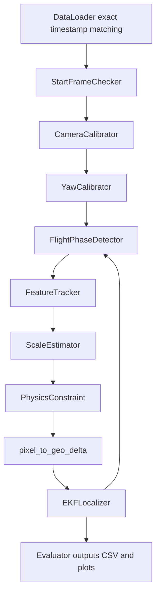

# Pure Vision UAV Localization Code Guide

This repository now uses the root-level modular pipeline described in
`main.py`, `config.py`, `modules/`, and `utils/`. The removed legacy
`src/uav_trajectory` and `run_trajectory.py` implementation is no longer part
of the active solution.

## Runtime Flow



## Files

- `config.py`: all thresholds, paths, phase parameters, physics limits, scale
  settings, and EKF noise settings.
- `main.py`: CLI entry point and end-to-end orchestration.
- `modules/data_loader.py`: exact timestamp matching between image filename
  stems and CSV timestamp strings.
- `modules/start_frame_checker.py`: blur, Shi-Tomasi corner count, and LK
  pretracking quality check for the start frame.
- `modules/camera_calibrator.py`: sampled ORB/F/H based calibration with
  empirical fallback and `output/calibration.json` caching.
- `modules/yaw_calibrator.py`: early-frame direction-only yaw calibration.
- `modules/flight_phase_detector.py`: phase A/B/C detection from estimated
  altitude history.
- `modules/feature_tracker.py`: Shi-Tomasi + LK tracking, forward/backward
  validation, RANSAC affine estimation, point refill, and ORB fallback.
- `modules/physics_constraint.py`: horizontal displacement, altitude step,
  3-sigma consistency, and hard altitude boundary checks.
- `modules/scale_estimator.py`: compensated divergence, affine scale,
  homography, EKF velocity fallback, cruise fixed-scale logic, trend checks,
  and smoothing.
- `modules/ekf_localizer.py`: 6-state phase-aware EKF with selective updates
  and altitude innovation reset.
- `modules/evaluator.py`: error metrics, `results.csv`, and required plots.
- `utils/geo_utils.py`: haversine and lon/lat/east/north/pixel conversions.
- `utils/visualization.py`: shared plotting helpers.

## Common Commands

```powershell
conda run -n uav python main.py --max-frames 100 --log-level INFO
conda run -n uav python main.py --recalibrate
conda run -n uav python main.py --output-dir output_full
```

Use `--initial-longitude`, `--initial-latitude`, and `--initial-altitude` when
the first-frame pose should be supplied externally. Without those arguments,
only the selected first CSV row is used as the initial condition; later GPS rows
remain sealed until evaluation.
