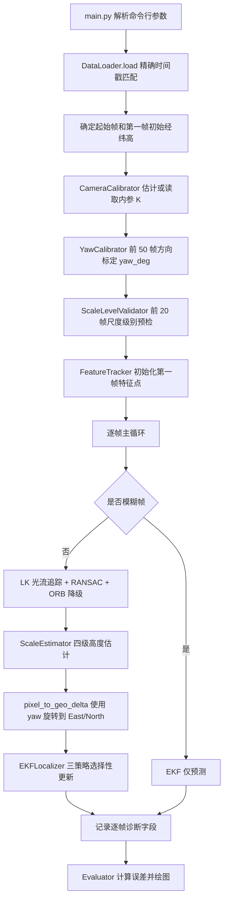

# 当前视觉定位方法代码阅读与算法流程

本文档对应当前主流程 `main.py` 以及 `modules/`、`utils/` 下的新实现，用于快速理解代码结构、数据流、核心算法和诊断字段。

## 1. 方法边界

当前系统是纯视觉无人机位置估计流程：

- 预测输入只允许使用第一帧经度、纬度、高度，以及连续红外图像。
- CSV 中后续帧经纬高只用于两个位置：偏航角初始化阶段的前 50 帧方向标定，以及最终误差评估。
- 偏航标定只使用 GPS 方向，不使用 GPS 距离作为尺度，不直接修正轨迹位置。
- 主循环中不再读取后续 GPS 真值参与预测。
- 不依赖回环检测，适用于不保证重叠的航线。

## 2. 当前目录结构

```text
F:/agent/UAV
+-- main.py
+-- config.py
+-- modules/
|   +-- data_loader.py
|   +-- camera_calibrator.py
|   +-- yaw_calibrator.py
|   +-- scale_level_validator.py
|   +-- feature_tracker.py
|   +-- scale_estimator.py
|   +-- ekf_localizer.py
|   +-- evaluator.py
+-- utils/
|   +-- geo_utils.py
|   +-- visualization.py
+-- docs/
|   +-- CURRENT_METHOD_CODE_READING.md
+-- output/
    +-- calibration.json
    +-- results.csv
    +-- trajectory_comparison.png
    +-- error_over_time.png
    +-- altitude_comparison.png
```

## 3. 总体调用链



## 4. 主入口 main.py

位置：[main.py](../main.py)

### 4.1 参数解析

`build_parser()` 定义主要命令行参数：

| 参数 | 作用 |
| --- | --- |
| `--image-dir` | 红外图像目录 |
| `--csv` | GPS 验证 CSV |
| `--output-dir` | 输出目录 |
| `--first-image-path` | 指定第一帧路径 |
| `--initial-longitude` | 第一帧初始经度 |
| `--initial-latitude` | 第一帧初始纬度 |
| `--initial-altitude` | 第一帧初始高度 |
| `--recalibrate` | 强制重新估计相机内参 |
| `--max-frames` | 限制处理帧数，便于调试 |
| `--log-level` | 日志级别 |

### 4.2 run(args) 主流程

`run()` 是系统总控函数，顺序如下：

1. 调用 `DataLoader.load()` 加载时间戳、图像路径和验证真值。
2. 根据 `--first-image-path` 找到起始帧索引。
3. 使用命令行初始经纬高；若未提供，则使用起始帧 CSV 记录作为第一帧初值。
4. 调用 `CameraCalibrator.estimate()` 获取相机内参。
5. 将内参按处理分辨率缩放。
6. 调用 `YawCalibrator.calibrate()` 估计 `config.CAMERA_YAW_DEG`。
7. 创建 `ScaleEstimator`，再由 `ScaleLevelValidator.validate()` 决定启用哪些尺度级别。
8. 初始化 `EKFLocalizer` 和 `FeatureTracker`。
9. 从第二帧开始逐帧执行视觉定位。
10. 调用 `Evaluator` 输出 CSV 和图表。

## 5. 数据加载 DataLoader

位置：[modules/data_loader.py](../modules/data_loader.py)

### 5.1 输出结构 LoadedData

```python
@dataclass(frozen=True)
class LoadedData:
    timestamps: list[str]
    image_paths: list[Path]
    gt_lon: list[float]
    gt_lat: list[float]
    gt_alt: list[float]
    delta_t: list[float]
```

### 5.2 核心逻辑

- CSV 列名支持中文和英文别名。
- 图像文件名去扩展名后作为时间戳字符串。
- 图像时间戳与 CSV 时间戳做精确字符串匹配。
- 匹配失败的图像只记录日志并跳过。
- `delta_t` 由相邻 13 位毫秒时间戳相减得到，单位为秒。

## 6. 相机内参 CameraCalibrator

位置：[modules/camera_calibrator.py](../modules/camera_calibrator.py)

### 6.1 输出结构 CalibrationResult

```python
@dataclass(frozen=True)
class CalibrationResult:
    K: list[list[float]]
    fx: float
    fy: float
    cx: float
    cy: float
    method: str
    confidence: float
```

### 6.2 策略顺序

1. 如果 `output/calibration.json` 存在且不是低置信经验内参，直接读取缓存。
2. 优先使用基础矩阵策略：
   - 均匀采样相邻帧对。
   - ORB 提取与匹配。
   - RANSAC 估计基础矩阵 `F`。
   - 扫描焦距，使 `E = K.T @ F @ K` 的本质矩阵奇异值更接近理想形式。
3. 若基础矩阵策略失败，尝试单应矩阵策略。
4. 若仍失败，使用经验内参：
   - `fx = fy = max(width, height) * 1.2`
   - `cx = width / 2`
   - `cy = height / 2`

### 6.3 关键修复点

低置信经验缓存会被忽略并重新估计，避免把旧的 `fx=768` 经验值长期带入水平尺度计算。

## 7. 偏航角标定 YawCalibrator

位置：[modules/yaw_calibrator.py](../modules/yaw_calibrator.py)

### 7.1 目标

解决视觉像素坐标系和真实 East/North 坐标系存在约 90 度系统性偏转的问题。

### 7.2 标定输入

- 前 `config.YAW_CALIBRATION_FRAMES` 帧图像。
- 同一段 GPS 真值的二维方向。
- 当前 `fx` 和初始高度，用于把像素位移转换为米级相对向量。

### 7.3 标定流程

1. 将前 50 帧 GPS 经纬度转换到局部 East/North 平面。
2. 计算相邻 GPS 方向向量 `[delta_east_gt, delta_north_gt]`。
3. 使用独立 `FeatureTracker` 跑同一段图像，得到视觉向量 `[delta_cam_x, delta_cam_y]`。
4. 最小化旋转后视觉方向与 GPS 方向的夹角残差。
5. 优先使用 `scipy.optimize.minimize_scalar`。
6. 如果 SciPy 不可用，使用网格搜索兜底。
7. 输出 `yaw_deg` 并写入 `config.CAMERA_YAW_DEG`。

### 7.4 跳过条件

如果前 50 帧 GPS 总位移小于 `config.YAW_MIN_GPS_DISPLACEMENT_M`，认为无人机几乎静止，跳过标定并记录警告。

## 8. 特征追踪 FeatureTracker

位置：[modules/feature_tracker.py](../modules/feature_tracker.py)

### 8.1 输出结构 TrackingResult

```python
@dataclass(frozen=True)
class TrackingResult:
    pixel_dx: float
    pixel_dy: float
    inlier_ratio: float
    is_keyframe_reset: bool
    num_tracked: int
    prev_points: np.ndarray
    curr_points: np.ndarray
    homography: np.ndarray | None
    method: str
```

### 8.2 LK 光流主流程

1. 第一帧用 Shi-Tomasi 检测角点。
2. 当前帧用 `cv2.calcOpticalFlowPyrLK` 前向追踪。
3. 再从当前帧反向追踪回上一帧。
4. 使用 forward-backward 残差剔除不稳定点。
5. 对剩余点使用 `cv2.estimateAffinePartial2D` 做 RANSAC。
6. 从内点的中位位移得到 `pixel_dx/pixel_dy`。
7. 如果跟踪质量低或窗口到期，触发关键帧重置。

### 8.3 ORB 降级

以下情况会降级到 ORB：

- LK 追踪失败。
- 有效点少于 8 个。
- RANSAC 仿射估计失败。
- 平均残差超过旋转/大运动阈值。

ORB 降级只用于当前帧位移估计，之后会重新初始化光流点。

## 9. 尺度估计 ScaleEstimator

位置：[modules/scale_estimator.py](../modules/scale_estimator.py)

这是当前版本的关键修复模块。旧版主要依赖单应矩阵分解，对经验内参非常敏感，容易导致 `scale_confidence=0`。当前实现改为四级结构。

### 9.1 输出结构 ScaleResult

```python
@dataclass(frozen=True)
class ScaleResult:
    estimated_altitude: float
    pixels_per_meter: float
    scale_confidence: float
    homography_inliers: int
    scale_method: int
    divergence_ratio: float
    affine_scale: float
    raw_alt_estimate: float
```

### 9.2 第一级：特征点发散比

函数：`_divergence_level()`

步骤：

1. 取追踪内点的前后位置 `p0/p1`。
2. 计算 `p1 - p0` 的中位平移，并从 `p1` 中扣除该平移。
3. 计算前后点到图像中心的距离 `d0/d1`。
4. 计算 `r = median(d1 / d0)`。
5. 当前代码按追踪点约定使用：

```text
altitude_t1 = altitude_t0 * r
```

说明：原始方案写作 `alt_t1 = alt_t0 / r`，但在当前代码中 `FeatureTracker` 已经把光流方向转换成无人机运动方向，实际诊断显示使用乘法能让高度趋势与真值一致。

置信度规则：

- 基础置信度 `0.8`。
- 点数少于 `SCALE_MIN_DIVERGENCE_POINTS` 时乘 `0.5`。
- `r` 超出 `[0.8, 1.25]` 时乘 `0.3`。
- 点分布过于集中时乘 `0.7`。

### 9.3 第二级：仿射缩放

函数：`_affine_level()`

步骤：

1. 用追踪点估计部分仿射矩阵。
2. 取线性部分 `A`。
3. 计算缩放：

```text
s = sqrt(abs(det(A)))
altitude_t1 = altitude_t0 * s
```

置信度规则：

- 基础置信度 `0.7`。
- 旋转角超过 10 度时乘 `0.3`。
- `s` 超出 `[0.8, 1.25]` 时乘 `0.3`。

### 9.4 第三级：单应矩阵分解

函数：`_homography_level()`

仅在 `calibration_confidence > 0.8` 且该级别未被预检禁用时启用。它不再是主要尺度来源。

### 9.5 第四级：EKF 高度速度外推

当其它级别低置信时，使用：

```text
altitude_t1 = altitude_t0 + v_alt * dt
```

该级别保证高度估计与 EKF 预测步一致，避免无效观测污染滤波器。

### 9.6 加权融合

各级候选按置信度和预设权重加权：

```python
SCALE_LEVEL_WEIGHTS = {1: 0.4, 2: 0.4, 3: 0.15, 4: 0.05}
```

最终：

- `estimated_altitude` 为加权高度。
- `scale_confidence` 为候选中的最高置信度。
- `scale_method` 为最高置信度对应的级别。

## 10. 尺度级别预检 ScaleLevelValidator

位置：[modules/scale_level_validator.py](../modules/scale_level_validator.py)

### 10.1 作用

在主循环前用前 20 帧测试四个尺度级别，自动禁用长期低置信的级别，避免后续浪费计算并减少无效候选干扰。

### 10.2 输出

返回启用级别集合，例如：

```text
enabled=[1, 2, 4]
```

日志会打印每级平均置信度：

```text
Scale level validation: L1=0.80 L2=0.70 L3=0.00 L4=0.00 enabled=[1, 2, 4]
```

## 11. 坐标转换 geo_utils

位置：[utils/geo_utils.py](../utils/geo_utils.py)

### 11.1 pixel_to_geo_delta()

修复后的转换不再硬编码 `pixel_dy` 正负，而是统一通过 yaw 旋转：

```text
meters_per_pixel = altitude / fx

delta_cam_x = pixel_dx * meters_per_pixel
delta_cam_y = pixel_dy * meters_per_pixel

delta_east  = cos(yaw) * delta_cam_x - sin(yaw) * delta_cam_y
delta_north = sin(yaw) * delta_cam_x + cos(yaw) * delta_cam_y

delta_lat = delta_north / 111320
delta_lon = delta_east / (111320 * cos(latitude))
```

其中 `yaw` 来自 `YawCalibrator`。

## 12. EKFLocalizer

位置：[modules/ekf_localizer.py](../modules/ekf_localizer.py)

### 12.1 状态向量

```text
x = [longitude, latitude, altitude, v_lon, v_lat, v_alt]
```

### 12.2 预测步

函数：`predict(dt)`

使用匀速模型：

```text
position = position + velocity * dt
velocity = velocity
```

### 12.3 选择性观测更新

函数：`update_visual(...)`

当前实现返回：

```text
(EKFState, ekf_update_mode)
```

三种模式：

| 模式 | 条件 | 更新内容 |
| --- | --- | --- |
| `1` | `inlier_ratio > 0.5` 且 `scale_confidence > 0.3` | 位置 + 高度 |
| `2` | `inlier_ratio > 0.5` 且 `scale_confidence <= 0.3` | 仅位置 |
| `3` | `inlier_ratio <= 0.5` | 仅预测，不做观测更新 |

这个修复避免 `scale_confidence=0` 时仍把 `delta_alt=0` 当成高度观测写入 EKF。

## 13. Evaluator 与输出

位置：[modules/evaluator.py](../modules/evaluator.py)

### 13.1 输出文件

```text
output/calibration.json
output/results.csv
output/trajectory_comparison.png
output/error_over_time.png
output/altitude_comparison.png
```

### 13.2 误差指标

- `horizontal_error`：haversine 水平误差，单位米。
- `altitude_error`：预测高度减真值高度。
- 汇总指标：
  - `MAE_horizontal`
  - `RMSE_horizontal`
  - `MAX_horizontal`
  - `MAE_altitude`
  - `RMSE_altitude`
  - `drift_per_frame`

## 14. results.csv 关键字段

### 14.1 位置字段

| 字段 | 含义 |
| --- | --- |
| `timestamp` | 帧时间戳 |
| `image_path` | 图像路径 |
| `pred_lon` | 预测经度 |
| `pred_lat` | 预测纬度 |
| `pred_alt` | 预测高度 |
| `gt_lon` | 验证经度 |
| `gt_lat` | 验证纬度 |
| `gt_alt` | 验证高度 |

### 14.2 视觉追踪字段

| 字段 | 含义 |
| --- | --- |
| `pixel_dx` | 无人机运动方向约定下的 x 像素位移 |
| `pixel_dy` | 无人机运动方向约定下的 y 像素位移 |
| `inlier_ratio` | RANSAC/LK 内点比例 |
| `is_keyframe_reset` | 是否重置关键帧 |
| `num_tracked` | 当前有效追踪点数量 |
| `blur_score` | 拉普拉斯方差 |
| `skipped_blur` | 是否因模糊跳过观测 |
| `method` | `initial`、`lk`、`orb`、`predict` 或 `exception` |

### 14.3 尺度与高度字段

| 字段 | 含义 |
| --- | --- |
| `scale_confidence` | 尺度估计置信度 |
| `homography_inliers` | 单应矩阵内点数 |
| `scale_method` | 当前采用的尺度级别，1/2/3/4 |
| `divergence_ratio` | 第一级发散比原始值 |
| `affine_scale` | 第二级仿射缩放原始值 |
| `raw_alt_estimate` | EKF 融合前高度估计 |
| `ekf_alt` | EKF 输出高度 |

### 14.4 偏航与 EKF 字段

| 字段 | 含义 |
| --- | --- |
| `yaw_deg` | 本次运行使用的偏航角 |
| `ekf_update_mode` | EKF 更新模式，1/2/3 |

### 14.5 误差字段

| 字段 | 含义 |
| --- | --- |
| `horizontal_error` | 水平误差，单位米 |
| `altitude_error` | 高度误差，单位米 |

## 15. 当前 100 帧验证结果示例

最近一次运行命令：

```powershell
conda run -n uav python main.py --max-frames 100 --log-level WARNING
```

关键诊断：

```text
yaw_deg = 79.195
scale_confidence mean = 0.802
pred_alt std = 10.55 m
drift_per_frame = 0.275 m/frame
ekf_update_mode = {1: 100}
```

误差摘要：

```text
MAE_horizontal = 27.192 m
RMSE_horizontal = 30.326 m
MAX_horizontal = 49.718 m
MAE_altitude = 15.230 m
RMSE_altitude = 18.420 m
drift_per_frame = 0.275 m/frame
```

说明：当前修复已经解决尺度置信度全 0、方向约 90 度偏转、低置信高度观测污染 EKF 三个结构性问题。前 100 帧水平误差仍未达到 10 m 以内，主要剩余误差来源是单目水平尺度、相机真实外参和飞行姿态未知。

## 16. 常用调试命令

编译检查：

```powershell
python -m compileall main.py modules utils config.py
```

短序列验证：

```powershell
conda run -n uav python main.py --max-frames 100 --log-level INFO
```

强制重新估计内参：

```powershell
conda run -n uav python main.py --max-frames 100 --recalibrate --log-level INFO
```

查看输出诊断：

```powershell
Import-Csv output/results.csv |
  Select-Object -First 10 timestamp,pixel_dx,pixel_dy,yaw_deg,scale_confidence,scale_method,ekf_update_mode,horizontal_error |
  Format-Table -AutoSize
```

## 17. 后续优化入口

优先级建议：

1. 若水平误差仍偏大，先检查 `output/calibration.json` 的 `fx` 和 `method`。
2. 若方向偏差明显，检查 `yaw_deg` 和前 50 帧是否存在足够 GPS 位移。
3. 若高度趋势反向，检查 `divergence_ratio` 与 `gt_alt` 的短窗口变化关系。
4. 若 `scale_confidence` 下降，检查 `num_tracked`、`inlier_ratio` 和 `blur_score`。
5. 若 `ekf_update_mode` 大量为 3，说明视觉追踪质量不足，应优先调 FeatureTracker 参数。
